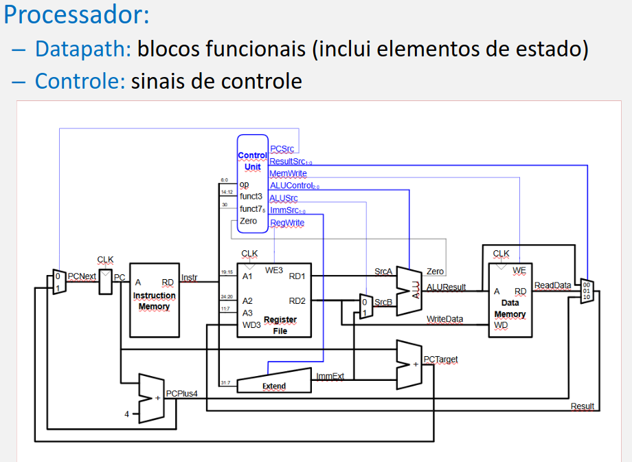
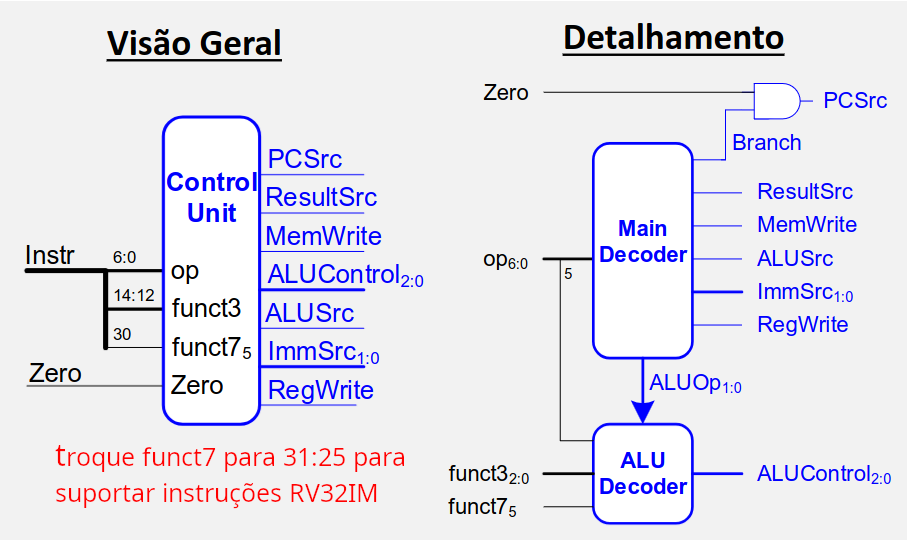
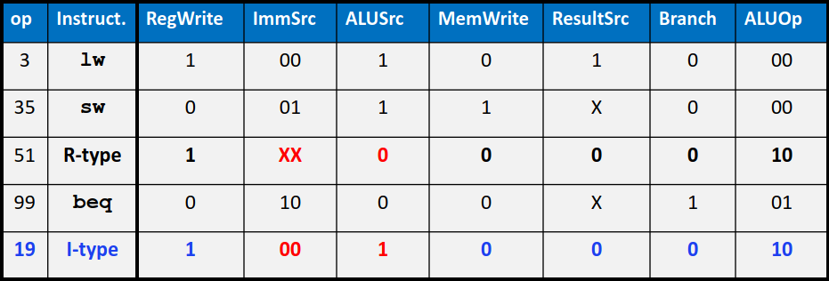
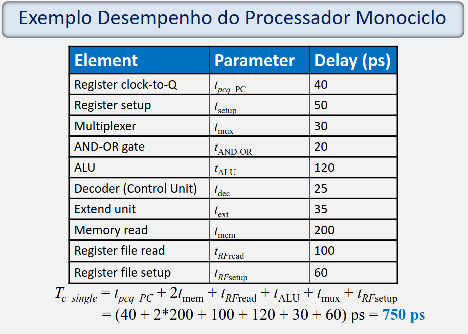
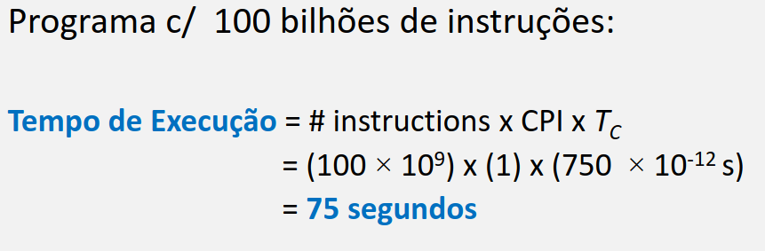
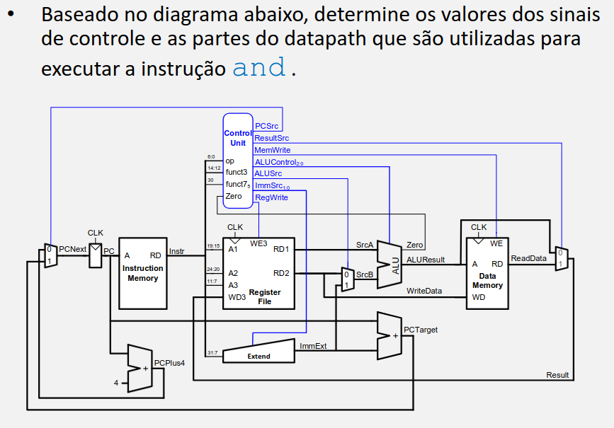

# Processador RISC-V Monociclo

Composto por Datapath e Controle.
- **Datapath:** Responsável pelo Fluxo de Dados
    - PC
    - Inst Memory
    - Reg Memory
    - ULA
    - Memória de Dados (RAM)
    - Somadores
    - Extensores de Sinal
    - Multiplexadores

**Exemplo:** Fluxo de Execução da Instrução `addi x1, x1, 1`

- Passo 1: Busca da Instrução (Instruction Fetch)
    - **PC:** Fornece o endereço da instrução atual para a entrada A da Instruction Memory.
    - **Instruction Memory:** Lê o endereço e joga os 32 bits da instrução no barramento Instr.
    - **Somador Inferior:** Calcula PC + 4 em paralelo e envia o resultado (PCPlus4) para o multiplexador do PC.

- Passo 2: Decodificação e Leitura dos Registradores (Decode)
    - **Controle:** Recebe os bits op e funct3 e ativa os sinais necessários: RegWrite = 1, ALUSrc = 1, ALUControl = Soma, MemWrite = 0, ResultSrc = 00 e PCSrc = 0.
    - **Reg Memory (Register File):** - Entrada A1 recebe o registrador rs1 (x1) e coloca seu valor atual na saída RD1 (SrcA).
        - Entrada A3 recebe o registrador rd (x1) para preparar o destino da escrita.
    - **Extensor de Sinal (Extend):** Extrai o imediato 1 da instrução de 32 bits e faz a extensão de sinal, gerando o ImmExt com valor 1.

- Passo 3: Execução (Execute)
    - **Multiplexador da ULA:** Com ALUSrc = 1, seleciona a entrada inferior (ImmExt) para ser o operando SrcB da ULA.
    - **ULA:** Recebe o valor de x1 (SrcA) e o valor 1 (SrcB), executando a operação de soma definida pelo controle. O resultado (x1 + 1) sai em ALUResult.

- Passo 4: Acesso à Memória de Dados (Memory)
    - **Memória de Dados:** Recebe o endereço vindo de ALUResult. Como o sinal MemWrite é igual a 0 (e não é uma instrução de Load), nenhuma operação de leitura ou escrita é realizada na RAM. O bloco fica inativo.

- Passo 5: Escrita dos Resultados (Write-Back)
    - **Multiplexador Final:** Com ResultSrc = 00, seleciona a entrada superior (ALUResult) e joga o valor calculado no barramento Result.
    - **Atualização de Estado (Borda de Subida do Clock):**
        - O valor do barramento Result entra por WD3 e é gravado no registrador x1 (apontado por A3).
        - O PC recebe o valor PCPlus4 vindo de PCNext (já que PCSrc = 0), avançando para a próxima instrução.

## Unidade de Controle Monociclo

Imagens abaixo. Recebe o funct3, funct7 e opcode da instrução atual e propaga os sinais de controle necessários para sua execução. Neste caso funct7 é apenas o bit 5 (bit 30 do barramento Instr) pois já é o suficiente para diferenciar as operações nesta implementação.

## Desempenho do Processador

Equação de Desempenho da CPU

$$CPU_{tempo} = IC \times CPI \times T_C$$

Mede o tempo total que um processador leva para executar um programa.

* **IC (Instruction Count):** Total de instruções executadas no programa. Depende do código e do compilador.
* **CPI (Cycles Per Instruction):** Média de ciclos de clock por instrução.No **Monociclo, $CPI = 1$** (uma instrução por ciclo).
* **$T_C$ (Clock Cycle Time):** Duração de um ciclo de clock (inverso da frequência). No Monociclo, é determinado pela instrução mais lenta (`lw`).

### Análise Dimensional
$$\text{Tempo} = \frac{\text{Instruções}}{\text{Programa}} \times \frac{\text{Ciclos}}{\text{Instrução}} \times \frac{\text{Segundos}}{\text{Ciclo}} = \frac{\text{Segundos}}{\text{Programa}}$$

---

## Exercício (Provavelmente vai cair na p2)

**Sinais de Controle**
- PCSrc: 0
- ResultSrc: 0
- MemWrite: 0
- ALUControl: 010 (AND)
- ALUSrc: 0
- ImmSrc: XX
- RegWrite: 1

---

**Partes do Datapath Utilizadas**
- **PC:** Armazena e fornece o endereço da instrução.
- **Instruction Memory:** Busca os 32 bits da instrução `and`.
- **Somador Inferior (PCPlus4):** Calcula o próximo endereço sequencial ($PC + 4$).
- **Register File:** Lê os registradores fontes (`rs1` e `rs2`) e escreve o resultado no registrador destino (`rd`).
- **Multiplexador da ALU:** Seleciona a entrada `0` (valor do registrador `rs2`).
- **ALU:** Realiza a operação lógica AND entre os dois registradores.
- **Multiplexador Final:** Seleciona a entrada `0` (resultado vindo da ALU).
- **Multiplexador do PC:** Seleciona a entrada `0` ($PC + 4$) para atualizar o PC.

---

**Partes Não Utilizadas**
- **Extend:** O imediato gerado é descartado pelo multiplexador da ALU.
- **Somador de Desvio (PCTarget):** O endereço de salto calculado é ignorado.
- **Data Memory:** Não há leitura nem escrita na memória RAM.