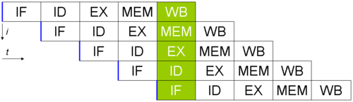
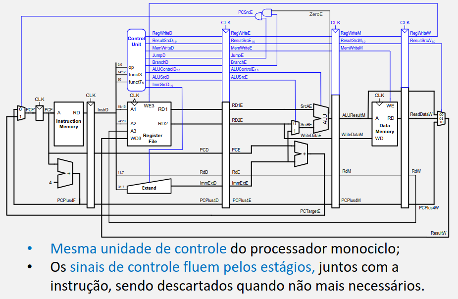
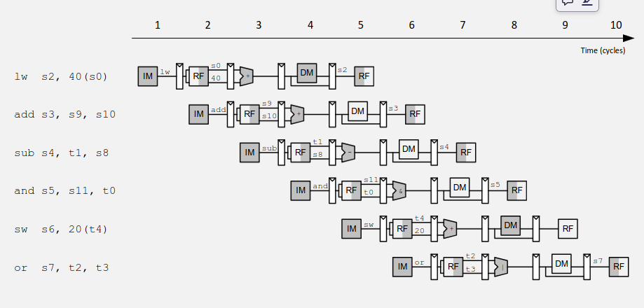
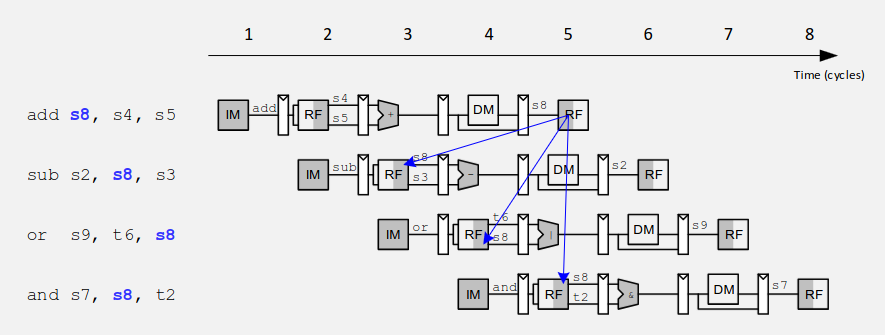
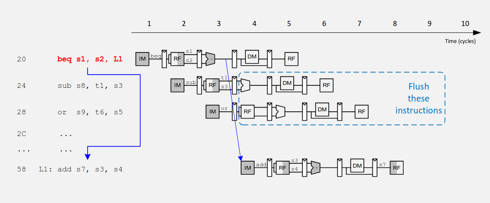
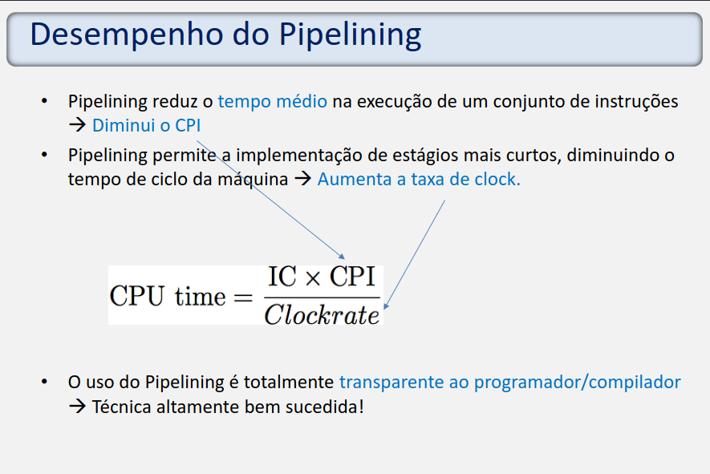
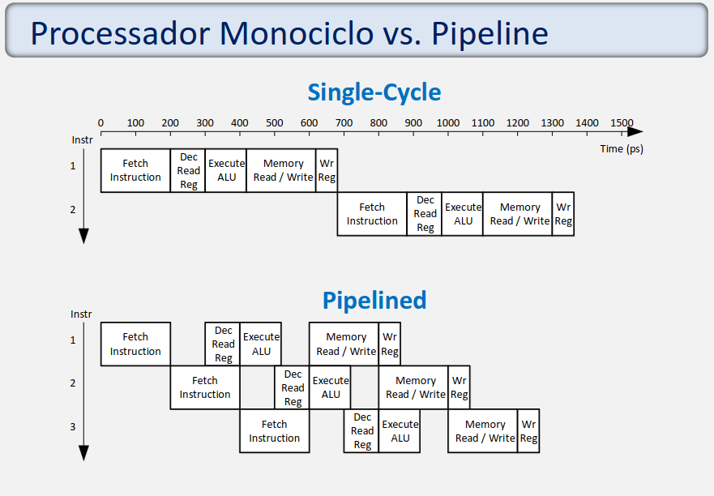

# Processador RISC-V Com Pipeline

No processador monociclo, apenas uma instrução é executada por ciclo, e a execução é limitada pela instrução mais demorada (`lw`).
Com o pipeline, as instruções são divididas em etapas e várias são executadas simultaneamente.
Isso não diminui a latência de cada tarefa, mas sim o `throughput`(taxa de produção).

**O Pipeline é implementado dividindo a execução monociclo em estágios e adicionando registradores de pipeline entre estágios.**

---

O Pipeline divide o processador em 5 estágios:
- **IF (Instruction Fetch):** Busca a instrução da memória, armazenando no
Registrador de Instrução (IR), atualizando o PC p/ PC+4
- **ID (Instruction Decode):** Envia o Opcode/funct7, funct3 p/ a unidade de
controle, lê o valor dos registradores determinados na
instrução (quando houver), faz a extensão de sinal de
valores imediatos
- **EX (Execute):** Depende da instrução a ser executada
- **MEM (Memory Acess):** Depende da instrução a ser executada
- **WB (Writeback):** Armazena no arquivo de registradores
resultados eventualmente obtidos em estágios anteriores

---

## Exemplo de execução no processador c/ pipeline

## Hazards

### Hazard de Dados

O valor do registrador ainda não foi gravado no arquivo de registradores. Também chamado de *RAW (Read after Write)*.

**Formas de lidar:**
- Inserir `nops`(addi x0, x0, 0) no código em tempo de compilação para dar tempo d o resultado ser gravado no regfile
- Reorganizar o código em tempo de compilação
- `Stalls` (congelar temporariamente partes do pipeline) -> Hardware Hazard Unit
- Encaminhamento (*forwarding*): ler do barramento diretamente o resultado -> Hardware Hazard Unit

### Hazard de Controle

A próxima instrução a ser executada ainda não foi decidida devido a um branch condicional.

**Formas de lidar:** 
Fazer `Stalls` até que a próxima instrução seja decidida no estágio de execute seria muito custoso em estruturas como loops (o pipeline teria que parar por dois ciclos para cada instrução de desvio). 
Com isso, uma alternativa é a estratégia de ***Branch Prediction*** (também necessita de hardware novo) para tentar prever se o desvio será tomado e descartar (*flush*) as instruções no estágio de fetch se a previsão for errada.

## Desempenho do Datapath com Pipeline

## Importante! Cálculo de CPI   

$$CPI = \frac{\text{Ciclos Totais}}{\text{Número de Instruções}}$$

## Continuar estudando pelos slides, muita coisa pra anotar